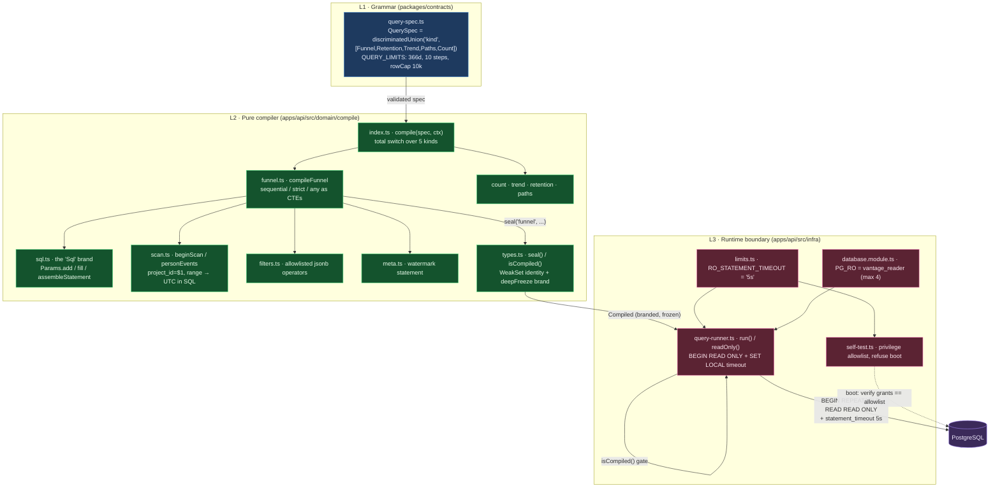

# Vantage — current implementation context

> Evidence snapshot updated 16 September 2026 IST. Canonical repository: `D:\Code\Vantage`; the release workflow deploys only after the full `main` CI gate succeeds. Treat `/health.release_sha`, the reviewed commit and both remote branches as a required equality check, because a configured URL or a green build alone is not deployment proof. The shipped web UI uses the approved glass redesign — a collapsible navigation rail, a `Ctrl K` command palette, Bricolage Grotesque / Manrope type, and a Settings shell that folds the three configuration screens. The behaviour, contracts, API, compiler, roles, and MCP surface are unchanged by the redesign. The public `none` adapter recognizes only explicitly allowlisted fixture questions; it never fuzzy-matches an unknown or injection-suffixed prompt.
>
> This document is fed to an external AI as the single briefing on Vantage: it is the short, exhaustive, AI-readable map, it explains the trending terms, and it carries the likely interview questions with answers (see the last three sections). Current source and executable tests win if an older design note disagrees. A dirty working tree is a candidate, not a release; a configured URL is not proof that the candidate is deployed.

## Product contract

Vantage is an auditable product-analytics system for event ingestion, funnels, retention, trends, paths, counts, and project management. A model may propose a typed `QuerySpec`; it cannot emit or execute SQL. The pure compiler creates parameterized `SELECT` statements, which run through a bounded read-only PostgreSQL role. The React UI returns the normalized spec, exact SQL, and result together. A stdio MCP server exposes bounded read-only analytics tools. The deployed app currently runs with `VANTAGE_LLM=none`, so canned Ask examples do not prove free-form LLM quality.

## Architecture and end-to-end flow

```text
event producer -> validated ingest contract -> normalization/idempotency -> PostgreSQL
Ask text -> selected adapter (or deterministic none) -> Zod QuerySpec
         -> pure compiler -> parameterized SELECT
         -> read-only transaction + 5 s timeout + row caps
         -> result + exact spec/SQL + audit metadata
```

Shared Zod contracts connect the React client, Nest API, compiler, and MCP surface. `(project_id, insert_id)` provides retry idempotency; a stable derived ID is used when callers omit one. Lint boundaries prevent Ask from obtaining the write pool and analytics modules from calling a model. Analytics semantics explicitly define project scope, time zone, bucket boundaries, first occurrence, conversion windows, identity stitching, and processing watermark.

## Code map

| Path | Responsibility |
| --- | --- |
| `packages/contracts/src` | public Zod contracts for ingest, projects, analytics, Ask, results, and MCP |
| `apps/api/src/domain/compile` | pure typed-spec to parameterized-SQL compilers and SELECT-only checks |
| `apps/api/src/modules` | ingest, identity, insights, Ask, audit, events, projects, MCP, health, and auth |
| `apps/api/src/infra` | read-only runner, transactions, limits, config, HTTP, and model adapters |
| `apps/api/migrations; apps/api/fixtures` | PostgreSQL roles/schema/indexes and stable hand-computed analytics fixture |
| `apps/web/src` | React 19 glass UI: eight-item rail (Ask, Funnel, Retention, Paths, Trend, Events, History, Settings), `Ctrl K` command palette, project state, forms, SQL/spec/result panels, and error states. `routes.ts` still resolves all ten route ids (`projects`, `mcp`, `health` are folded into Settings but remain deep-linkable) |
| `apps/api/test; apps/web/test; apps/web/e2e` | unit, integration, component, and real-browser contracts |
| `docs/VERIFICATION.md; docs/DEPLOY.md` | current local evidence and release mapping/operations |
| `MEMORY.md` | durable AI handoff, decisions, workflow map, limits, and verification order |

## Invariants and trust boundaries

- Model output ends at validated `QuerySpec`; it cannot supply SQL syntax, identifiers, operators, or arbitrary expressions.
- Only the compiler creates parameterized SELECT SQL; execution uses `vantage_reader`, a read-only transaction, timeout, and row cap.
- Ingest retries for the same project/insert ID cannot double-count; normalization and derived identity must be stable.
- Time zone, identity merge, first occurrence, conversion window, and bucket semantics require fixture-backed tests.
- Raw API keys are shown only at create/rotate boundaries; stored keys are hashed and auth headers are never logged.
- MCP is read-only and intentionally has neither generic SQL nor model-backed Ask.

## User workflows to preserve

- Select/create a project; switch/copy ingest snippets; load the August fixture; rotate a key; inspect empty and error states.
- Submit supported and hostile Ask text; inspect/edit the spec, run/cancel, inspect exact SQL/result, and open History.
- Configure and run funnel, retention, trend, path, and count analyses with time/project boundaries and result/empty/error states.
- Browse Events and keyboard-select event details/properties; reach every screen from the rail (keys 1–7, Settings on 0) or the `Ctrl K` command palette; the three folded screens (Projects, MCP, Health) open inside the Settings shell with their tab pre-selected and still resolve as deep links.
- Exercise real stdio MCP protocol tests separately from the illustrative MCP page.
- Verify all routes and top-bar controls at 320 px without page-level overflow or unnamed visible controls.

## Concepts this project teaches

| Concept | How it appears here |
| --- | --- |
| DSL and compiler boundary | a small typed query language constrains model intent before SQL exists |
| Least-privilege databases | separate owner/write/read roles and read-only transactions reduce blast radius |
| Idempotent ingestion | stable insert keys make retries safe |
| Analytics semantics | funnels, cohorts, retention, paths, buckets, and identity merges are explicit algorithms |
| Defense in depth | Zod validation, pure compiler, SQL scanner, parameters, role, timeout, and caps overlap |
| MCP boundaries | stdio tools expose typed read-only operations without generic execution authority |

## CI, packaging, deployment, and rollback

Run `npm run docs:check`, `npm run check`, `npm run bench`, `npm run build`, and `npm run web:build`; build/smoke the release container. CI runs type/lint/boundary, API/contracts/integration, web/browser, production dependency, and benchmark gates. Release automation deploys only after successful `main` CI when `FLY_API_TOKEN` exists. Both automated and manual builds pass the exact commit as `VANTAGE_RELEASE_SHA`; the manual path is `fly deploy --app vantage-abheet --remote-only --depot=false --build-arg VANTAGE_RELEASE_SHA=<40-char HEAD>`. Required database/query/admin secret names are documented without values.

For every release, run migrations and gates at one commit, then record source/image/release/machine plus post-deploy health, auth refusal, Ask/spec/SQL/result, route, MCP-boundary, and rollback evidence. `/health.release_sha` is null for an ordinary local process and the exact lowercase 40-character commit for a release build. The public demo uses deterministic `VANTAGE_LLM=none`; a successful canned Ask remains evidence of the boundary and UI flow, not arbitrary model quality.

## Current measured evidence

| Result | Evidence |
| --- | --- |
| 857 distinct cases passed: 682 API/contracts/integration + 160 web + 15 PostgreSQL/Chromium workflows; all coverage gates passed | `D:\Code\Vantage\docs\VERIFICATION.md` |
| Every route/global control plus analytics, disclosure, table, refresh, copy and 320 px semantic workflows passed with zero page errors | `apps\web\e2e\release-cta.spec.ts; D:\Code\Vantage\docs\VERIFICATION.md` |
| Bounded local Lighthouse: 99 performance, 100 accessibility, 100 SEO, 1.7 s LCP, 0 CLS | `D:\Code\Vantage\docs\VERIFICATION.md` |
| Exact public commit, Fly release/image, `/health.release_sha`, and live smoke receipt | `verification-work\portfolio-release-20260910\VANTAGE_RELEASE_SIGNOFF.md; D:\Work\Vantage Study Pack\08_TESTING_ARTIFACT.md` |

The evidence above belongs to the named local working-tree snapshot unless it explicitly names a release/image. It does not become live evidence merely because a deployment configuration exists.

## Open limits

- The public canned Ask path does not prove Anthropic/Ollama availability, accuracy, grounding, or spend behavior.
- A shared admin gate is not per-user authentication, RBAC, or tenant isolation.
- No arbitrary SQL endpoint exists by design; do not add one for convenience.
- Local Lighthouse and tests do not establish field Core Web Vitals, internet-scale ingestion, database failover, backup restore, or multi-region operation.
- A new commit is not a deployed release until the release metadata and post-deploy probes map to that exact SHA.

## Reading order

1. `MEMORY.md` — durable AI handoff and current decisions
2. `CONTEXT.md` — trust and release boundary
3. `D:\Work\Vantage Study Pack\01_Vantage_Concepts_From_Zero.md` — analytics, SQL, API, and security vocabulary
4. `docs/01-DESIGN.md; docs/02-LLD.md` — domain semantics, boundaries, and implementation slices
5. `packages/contracts; apps/api/src/domain/compile` — typed language and compiler
6. `apps/api/src/modules; apps/api/src/infra; apps/api/migrations` — HTTP, storage, roles, and model boundary
7. `apps/web/src; packages MCP entry points` — user and tool surfaces
8. `D:\Work\Vantage Study Pack\03_Vantage_System_Design_DSA_TypeScript_Walkthrough.md` — system design and code-to-deploy
9. `docs/SANITY.md; docs/VERIFICATION.md; docs/DEPLOY.md` — run and release evidence

Use `docs/SANITY.md` in the repository, or `09_SANITY_CHECK.md` in the Study Pack, before claiming that a new change works.

## Rules for the next coding agent

1. Never let model text cross the typed-spec boundary into SQL syntax.
2. Keep Ask away from the write pool and analytics away from model adapters; preserve lint enforcement.
3. Treat analytics semantics as public contracts and change them only with hand-computed fixture tests.
4. Keep API keys hashed, logs payload-safe, MCP read-only, and time/row bounds explicit.
5. Keep local, CI, image, and Fly evidence separate; do not call a candidate deployed until all four map to one commit.

## Redesigned glass UI and the demo reel

The `redesign-glass` branch re-skins the front end to the approved artifact without touching the engine:

- **Navigation.** A collapsible glass rail (68 px collapsed / 206 px expanded) lists the seven analysis/history screens (keys 1–7) plus a Settings entry (key 0). Settings is a shell with a three-tab sub-nav — Projects & ingest, MCP, Health — so no route is lost; `projects`, `mcp`, `health` remain first-class ids that deep links, cross-links, and the command palette resolve.
- **Command palette.** `Ctrl K` opens a "Jump to…" palette over every route — the fast path a keyboard user takes instead of the rail.
- **Type and glass.** Bricolage Grotesque (display) + Manrope (body); glass lives only on the navigation layer, data surfaces stay opaque so numbers read cleanly. Dark is the default theme.
- **The query card is unchanged in meaning:** it still renders *question → typed spec (violet) → SQL · what actually ran (amber, with the `role vantage_reader · READ ONLY · timeout 5 s` badge and `$1…$n` params) → the number*, in that order, on Ask and behind every manual builder.

**The demo reel** (`tools/capture-reel60.mjs`) drives the LIVE site with Playwright and encodes with ffmpeg: it pins the hand-checked "August fixture" project, clicks the flagship example question, and films the answer resolving spec → SQL → funnel bars (signup 13 → create_project 6 → invite_teammate 3 in a 7-day window), then glances at the Funnel and Retention screens. Output: `docs/media/vantage-reel.mp4` (H.264, 1280×800, motion-interpolated to a true 60 fps via `ffmpeg -r 60` + the `minterpolate` filter) and a looping `docs/media/vantage-demo.gif` for the README. ffmpeg is auto-detected (PATH → the winget path → `$FFMPEG`). Because the public demo runs `VANTAGE_LLM=none`, the canned example proves the boundary and UI flow, not free-form model quality.

## Trending terms explained (glossary for the interview)

- **MCP (Model Context Protocol).** An open standard (spec dated 2026-07-28) for exposing tools/resources to LLM clients over a transport such as stdio. Vantage ships a stdio MCP server of eight read-only analytics tools, each annotated `readOnlyHint: true, destructiveHint: false`. There is deliberately **no `run_sql` and no `ask` tool** — the client's own model does English→spec, so Vantage needs no LLM key to be usable from Claude Desktop/Code.
- **LLM→SQL / text-to-SQL boundary.** The industry-standard risky pattern is "let the model write SQL." Vantage's thesis is the opposite: the model may only fill a typed **`QuerySpec`**; it can never emit SQL syntax, identifiers, or operators. This is the single most important idea in the repo — a *structural* boundary, not a prompt instruction.
- **QuerySpec (a small DSL).** A domain-specific language expressed as a Zod schema with a discriminated union on `kind` (`funnel | retention | trend | paths | count`). The grammar has no free-text/expression field, so there is nothing for injected SQL to ride in on. The pure compiler is the only thing that turns a spec into SQL.
- **Least privilege / read-only role.** Three Postgres roles: `vantage_owner` (migrations), `vantage_app` (INSERT-only ingest), `vantage_reader` (SELECT-only). Analytics run as `vantage_reader` inside a `READ ONLY` transaction with a 5 s `statement_timeout` and a row cap — defense in depth, so even a compiler bug or a hostile spec cannot write or run long.
- **Parameterised query.** The compiler emits `SELECT … WHERE project_id = $1 …` and binds values separately (`$1…$n`); no string interpolation of user/model data into SQL. This is what the "SQL · what actually ran" panel shows, params and all.
- **Idempotent ingestion.** `UNIQUE (project_id, insert_id)` + `ON CONFLICT DO NOTHING`; retries of the same event cannot double-count. When a client omits `insert_id`, a stable key is derived so retries still dedupe. The response reports `duplicates: n`.
- **Window-function CTEs / funnel semantics.** Funnels are computed with SQL window functions over per-person event streams (not exploding self-joins). Correctness details: `AT TIME ZONE` bucketing before `date_trunc` (a 22:00 Mumbai signup must not fall in yesterday's UTC cohort), **first-occurrence** step semantics, and a conversion window counted from the *first* qualifying event.
- **Retention cohort / heatmap.** Users grouped by first-start-event day (in the project timezone); a cell is "retained" if the return event happened in that period. Periods that have not finished are marked **in progress** (hatched), computed in the SQL, never guessed.
- **Covering index / BRIN.** Two covering indexes are tied to the specific funnel/retention queries so the planner can serve them from the index; BRIN suits the append-only, time-ordered events table. The point of the project is *index design + real `EXPLAIN (ANALYZE, BUFFERS)` plans*, which is why it is Postgres and not DuckDB/SQLite.
- **Zod contracts.** One Zod schema is simultaneously the HTTP DTO, the MCP `inputSchema`, and the TypeScript type — a single source of truth across the client, API, compiler, and tool surface.
- **Property-based testing (fast-check) + hand-computed fixture.** The compiler is fuzzed with property tests; correctness is pinned by a 1,046-submission fixture whose adversarial rows (window-boundary conversions, out-of-order events, a second signup that must not restart the clock, a cross-midnight timezone case, one identity merge) have hand-written expected numbers in `august.expected.md`. A plausible wrong number fails a test that names the person and the reason.
- **Identity stitching.** Anonymous→identified merges via a `person_distinct_ids` mapping, so a user's pre- and post-login events count as one person.
- **Honest result status.** Every result carries `status ∈ {complete, empty, timed_out, truncated, refused}` and a `data_until` watermark; a timeout returns *nothing*, never a partial 200.
- **Release SHA gating.** A release container stamps its exact commit at `/health.release_sha`; a build is "deployed" only when local commit, `origin/main`, the Fly image, and that live field all map to one SHA.

## Likely interview questions and answers

**Q. Why not just let the model write SQL and sandbox it?**
A. Sandboxing SQL is a blacklist problem — you are forever chasing what to forbid. Vantage inverts it to a whitelist: the model fills a typed `QuerySpec` with no field that can carry SQL, and a pure compiler is the *only* producer of SQL. Even a perfect jailbreak yields text that fails Zod validation and is refused with the raw output shown. The read-only role, transaction, timeout, and row cap are independent backstops if the layer above ever failed.

**Q. Walk me through what happens when I ask a question.**
A. `AskModule` sends the grammar + the event catalog (fenced as *data*) + the question to the selected model port. The reply is parsed as a `QuerySpec`; invalid → refused (audited, raw kept). Valid → the pure compiler emits a parameterised `SELECT`; `InsightsModule` runs it as `vantage_reader` in a `READ ONLY` transaction with a 5 s timeout; the response returns the number, the exact spec, the exact SQL, and audit metadata. The UI renders spec → SQL → number in that order.

**Q. How do you guarantee the analytics numbers are correct?**
A. A hand-computed fixture loaded through the real ingest endpoint, with deliberately adversarial rows, and expected values written out by hand. Funnel/retention/trend/paths each have fixture-backed tests; boundary rows fail by name. Semantics (timezone, first occurrence, conversion window, buckets, identity merge, watermark) are treated as public contracts changed only with fixture tests.

**Q. What can a hostile model actually cause here?**
A. At worst a *valid but wrong* query — which is why the SQL is always shown — and up to five seconds of one read-only connection. It cannot write, alter, create, read a table outside the four granted, exceed the row cap, run two statements, or be steered by an event name into anything the grammar cannot express.

**Q. Why NestJS, and what do the module boundaries buy you?**
A. The module/DI structure makes the two dangerous seams *visible and enforced*: `AskModule` can reach the model but not the write pool; `InsightsModule` can run SQL but cannot reach the model. A lint/dependency rule fails the build if either boundary is crossed, so the security argument is checked by CI, not just by convention.

**Q. Why Postgres over DuckDB or SQLite for an analytics project?**
A. The learning goals are index design, query plans, and a database-enforced read-only role. Only Postgres gives real roles, a server-side `statement_timeout` that can interrupt a running query, and `EXPLAIN (ANALYZE, BUFFERS)`. DuckDB's Node client cannot interrupt; SQLite has no roles and weak date maths.

**Q. What does the MCP server expose, and why no `run_sql`?**
A. Eight read-only, typed tools over stdio; every result carries the SQL it ran. Omitting `run_sql`/`ask` keeps the same structural boundary at the tool surface: the MCP client's model composes a typed request, Vantage compiles and runs it read-only. It also means the public MCP path needs no LLM key.

**Q. How is the public demo deployed, and what does the canned Ask prove?**
A. A single Docker container (Caddy in front of the Nest API and the built SPA) on Fly.io with auto-stop; release builds stamp `/health.release_sha`. The demo runs `VANTAGE_LLM=none`, so a successful example proves the boundary, compiler, and UI flow end to end — not free-form model accuracy, which requires the Anthropic/Ollama ports.

**Q. What are the honest limitations?**
A. No per-user auth/RBAC/tenant isolation (only shared read/admin bearer tokens); no arbitrary-SQL endpoint by design; no saved dashboards, streaming, alerting, or A/B analysis; local Lighthouse/tests do not establish field Core Web Vitals or internet-scale ingestion/failover. These are deliberate scope cuts, documented in `01-DESIGN.md §7`.


## Annotated core code + knowledge graph

> This section is the "read the code on the screen" companion to the sections above. It is grounded entirely in the real source on branch `redesign-glass` under `apps/api/src/` — every file, function, constant, and CTE name below is quoted verbatim from that tree. It exists so this briefing can answer "explain this code", "why is it written this way", and "what's the complexity/trade-off" for the LLM→SQL guardrail: the typed `QuerySpec`, the pure compiler that turns it into parameterized read-only SQL, and the database-enforced read-only role + timeout.

### The guardrail in one sentence

A model never emits SQL. It proposes a `QuerySpec` (a Zod discriminated union); a **pure, side-effect-free compiler** turns that validated spec into a single parameterized `SELECT` in which **every value is a `$n` placeholder and every identifier is a source literal**; the compiler `seal`s the result behind a private brand; and a `QueryRunner` refuses to execute anything that is not sealed, running it as role `vantage_reader` inside a `REPEATABLE READ READ ONLY` transaction with a database-enforced `statement_timeout` of `5s`. Three layers — grammar (L1), pure compilation (L2), runtime role/timeout (L3) — each of which alone bounds the blast radius.

### Knowledge graph — modules, ownership, and flow



**One line per file that matters (all under `apps/api/src/`, contracts under `packages/`):**

- `packages/contracts/src/query-spec.ts` — the grammar: `QuerySpec` Zod discriminated union over `kind`, plus `QUERY_LIMITS` (rangeDays 366, rowCap 10_000, breakdownValues 50, filterValues 50); a spec is fully validated before any compiler sees it.
- `domain/compile/index.ts` — `compile(spec, ctx)`: a single `switch (spec.kind)` with no `default`, so the five kinds are exhaustively covered and adding a compiler is one line.
- `domain/compile/sql.ts` — the `Sql` branded string and `Params`; the only two producers of SQL text (`fill` for `{name}` holes, `Params.add` for a `$n`), so a spec value has no path into SQL except as a parameter.
- `domain/compile/scan.ts` — `beginScan`/`personEvents`: writes `project_id = $1` and the timezone-correct range once; `$1..$4` are always project, tz, from, to.
- `domain/compile/filters.ts` — `where` clauses as an allowlisted `Record<FilterOp, template>` over jsonb operators; key and value are always parameters.
- `domain/compile/funnel.ts` — `compileFunnel`: the largest algorithm; builds the funnel as a chain of named CTEs, one per `sequential`/`strict`/`any` order, plus optional breakdown.
- `domain/compile/{count,trend,retention,paths}.ts` — the other four compilers, same shape.
- `domain/compile/meta.ts` — `compileMeta`: the watermark statement (`data_until`, merges, adjusted share) compiled for the same project/range and run in the same snapshot.
- `domain/compile/types.ts` — `seal()`/`isCompiled()`: the private-brand trust boundary that makes `Compiled` unforgeable.
- `infra/query-runner.ts` — `QueryRunner.run()`/`readOnly()`: the only code that executes query-path SQL; enforces `isCompiled`, `READ ONLY`, and the timeout.
- `infra/limits.ts` — `RO_STATEMENT_TIMEOUT = '5s'`, the single constant the runner enforces and the self-test checks.
- `infra/database.module.ts` — two pools/two roles; `PG_RO` is `vantage_reader`, max 4 connections.
- `infra/self-test.ts` — at boot, reads live grants and refuses to start unless both roles' privileges equal an explicit allowlist (a widened GRANT fails boot exactly like a missing one).

### Excerpt 1 — `sql.ts`: why a spec value can never become SQL text (the parameterization crux)

The whole guardrail rests on one type trick: SQL text is a *branded* string `Sql` that only two functions can produce. TypeScript then makes every template hole demand an `Sql`, so a raw spec value simply does not type-check into a query.

```ts
// sql.ts
declare const SQL_BRAND: unique symbol;
export type Sql = string & { readonly [SQL_BRAND]: true };   // a nominal brand: a plain string is NOT an Sql

export class Params {
  private readonly values: unknown[] = [];                   // the ordered $1,$2,… values handed to pg
  private readonly labels: string[] = [];                    // human labels for the "-- $n …" legend only
  add(value: unknown, label: string): Sql {                  // the ONLY way a value enters a query
    this.values.push(value);                                 // the value goes into the params array…
    this.labels.push(label);
    return `$${this.values.length}` as Sql;                  // …and the SQL only ever sees "$3", never the value
  }
  get list(): readonly unknown[] { return this.values; }
}

const HOLE = /\{(\w+)\}/g;                                   // templates carry {name} holes, never ${…}
export function fill(template: string, holes: Readonly<Record<string, Sql>> = {}): Sql {
  const unused = new Set(Object.keys(holes));
  const out = template.replace(HOLE, (_m, name: string) => {
    const fragment = holes[name];
    if (fragment === undefined) throw new Error(`fill: no fragment for {${name}}`); // an unfilled hole is a compiler bug → test sees it
    unused.delete(name);
    return fragment;                                         // each fragment is itself an Sql (a $n or another filled template)
  });
  if (unused.size > 0) throw new Error(`fill: fragment(s) ${[...unused].join(', ')} not used`); // an unused fragment is also a bug
  return out as Sql;
}

export function assembleStatement(ctes: readonly Sql[], select: Sql, p: Params, rowCap: number): Sql {
  const limit = p.add(rowCap + 1, 'row cap + 1 (the extra row reveals truncation)'); // ask for cap+1 rows: the extra row is how the runner detects truncation
  const head = ctes.length > 0 ? 'WITH ' + ctes.join(',\n') + '\n' : '';
  return (head + select + '\nLIMIT ' + limit + '\n' + p.legend()) as Sql;  // one statement, no ';', LIMIT always present
}
```

- Line by line: `SQL_BRAND` is a `unique symbol` used only in the type, so `Sql` is *nominal* — `"DROP TABLE" as string` is not assignable to `Sql`. `Params.add` pushes the value onto `values` and returns the placeholder string `$n`; the value never appears in returned text. `fill` substitutes only `{name}` holes and each replacement must itself be an `Sql`, so the recursion bottoms out at either a literal template fragment or a `$n`. Both an *unfilled hole* and an *unused fragment* throw, turning a mis-wired template into a loud test failure rather than a silent malformed query. `assembleStatement` appends exactly one `LIMIT` bound to `rowCap + 1` — the "+1" is the truncation sentinel the runner reads later.
- A companion lint (`tools/lint-sql.mjs`) forbids `${}` inside any SQL template literal, so the only two doors into SQL are `fill` and `Params.add`.
- **Interviewer might ask:** *"How do you actually prevent SQL injection here — isn't it just string building?"* Answer: No value is ever concatenated. Every value goes through `Params.add`, which returns a `$n` and stores the value in a parallel array passed to `pg` as bound parameters; identifiers are compile-time string literals in this directory, and the `Sql` brand plus the `lint-sql` rule make "a value became SQL text" a compile-time or CI failure, not a runtime hope. The complexity is O(size of the template) per `fill`, negligible; the trade-off is verbosity (templates with named holes) bought in exchange for a machine-checkable guarantee.

### Excerpt 2 — `funnel.ts`: the core algorithm, a funnel as a readable chain of CTEs

`compileFunnel` is the largest compiler and the best illustration of "compile a typed spec into SQL." It never interpolates a spec value; it emits one CTE per funnel step, each a sentence you can read aloud. The `sequential` order is the default and the clearest:

```ts
// funnel.ts — the sequential step template and how each step CTE is built
const FIRST_STEP = `SELECT person_id, min(event_ts) AS t1
FROM e
WHERE is_step[1]
GROUP BY person_id`;                                   // step 1 = each person's FIRST occurrence of step 1 in range

const NEXT_STEP_SEQUENTIAL = `SELECT s{prev}.person_id, s{prev}.t1, min(e.event_ts) AS t{k}
FROM s{prev}
JOIN e ON e.person_id = s{prev}.person_id
WHERE e.is_step[{k}] AND e.event_ts > s{prev}.t{prev} AND e.event_ts <= s{prev}.t1 + {window}::interval
GROUP BY s{prev}.person_id, s{prev}.t1`;               // step k = earliest step-k STRICTLY after step k-1, still within the window from t1

function sequentialSteps(f: FunnelParts): Sql[] {
  const ctes = [firstStep("each person's first step 1 in range: the funnel starts there and nowhere else")];
  for (let k = 2; k <= f.stepCount; k++) {             // one CTE s2..sN, chained on the previous step
    const why = k === 2 ? 'earliest step 2 strictly after t1, inside the window'
                        : `earliest step ${k} strictly after t${k - 1}, still inside the window from t1`;
    ctes.push(cte(`s${k}`, why,                        // cte(name, sentence, body): the sentence rides in the SQL as a comment
      fill(NEXT_STEP_SEQUENTIAL, { prev: index(k - 1), k: index(k), window: f.window }))); // holes filled only with index()/$n, never a spec value
  }
  return ctes;
}
```

- Line by line: `is_step` is a boolean array tagged per event in the `e` CTE, so one event can satisfy several steps (a `signup → signup` funnel is legal). `FIRST_STEP` pins first-occurrence semantics: the funnel starts at each person's *earliest* step 1, `min(event_ts) AS t1`. `NEXT_STEP_SEQUENTIAL` uses a strict `>` (a step 2 one millisecond before step 1 does not count) and `<= t1 + window` (the window is inclusive of its last instant). Crucially the only things filling the holes are `index(k)` — which admits a positive integer and nothing else, so `s3`/`t3` derive from a *count*, never a caller-chosen name — and `f.window`, which is a `$n` placeholder (the interval `"14 days"` was pushed via `Params.add` in `compileFunnel`). `cte(name, why, body)` embeds the plain-English sentence as a `-- comment` so the emitted SQL reads like prose in the UI's SQL panel.
- The `strict` order swaps in a `stream` CTE using `lead() OVER (PARTITION BY person ORDER BY event_ts, event_id)` so "the event right after step k must be step k+1"; `any` order builds `anchors`/`converted` CTEs that ask whether one window of length W contains every step. Ties in `event_ts` break on `event_id` (a UUIDv7 minted at arrival), so a run is deterministic.
- **Interviewer might ask:** *"Why CTEs instead of one big join, and what's the cost?"* Answer: each CTE is independently testable and readable (the fixture pins boundary rows by name), and Postgres can materialize/inline them; the sequential funnel is N-1 self-joins of the tagged-event CTE `e`, each bounded by the window predicate and the person key, so it scales with events-per-person-in-range, not the whole table. The trade-off vs. a hand-tuned single query is some redundant scanning of `e`; it is accepted because correctness and auditability (a reviewer reading the SQL aloud) are the project's stated goals, and the row cap + 5s timeout bound the worst case regardless.

### Excerpt 3 — `types.ts` + `query-runner.ts`: the unforgeable `Compiled` and the read-only, time-bounded execution

The compiler's output is trusted by exactly one executor. To make "trusted" real, `Compiled` is branded by identity (a private `WeakSet`), not by shape, and frozen deeply; the runner refuses anything else and runs it read-only with a database-enforced timeout.

```ts
// types.ts — the brand only seal() can mint, checked by identity not shape
const COMPILED = Symbol('vantage.compiled');
const SEALED = new WeakSet<object>();                        // every object seal() ever produced; membership is the proof

export function seal(kind, ctx, statement, meta): Compiled {
  const compiled = {
    kind,
    ctx: deepFreeze({ projectId: ctx.projectId, timezone: ctx.timezone, rowCap: ctx.rowCap }),
    sql: statement.sql,
    params: deepFreeze([...statement.params]),                // a COPY is frozen, so the caller can't mutate params after sealing
    meta: deepFreeze({ sql: meta.sql, params: [...meta.params] }),
  };
  Object.defineProperty(compiled, COMPILED, { value: true, enumerable: false }); // non-enumerable → a spread {...c} drops it
  Object.freeze(compiled);
  SEALED.add(compiled);                                       // identity registered here and nowhere else
  return compiled as unknown as Compiled;
}

export function isCompiled(value): value is Compiled {
  if (typeof value !== 'object' || value === null || !SEALED.has(value)) return false; // identity: a copy is never a member
  const c = value as Compiled;
  return Object.isFrozen(c) && Object.isFrozen(c.ctx) && Object.isFrozen(c.params)
      && Object.isFrozen(c.meta) && Object.isFrozen(c.meta.params);                     // integrity: every part still frozen
}
```

```ts
// query-runner.ts — the only executor of query-path SQL
async run<T>(c: Compiled, decode): Promise<RunOutcome<T>> {
  if (!isCompiled(c)) throw new Error('QueryRunner.run: the statement was not produced by compile()'); // V7b: refuse anything unsealed
  const client = await this.acquire();                        // from PG_RO = vantage_reader, pool max 4, fail-fast when saturated
  try {
    await this.begin(client, 'BEGIN ISOLATION LEVEL REPEATABLE READ READ ONLY'); // one snapshot for query + watermark; READ ONLY blocks writes
    const result = await client.query(c.sql, [...c.params]);  // bound params; c.sql contains only $n placeholders
    const watermark = await client.query<MetaRow>(c.meta.sql, [...c.meta.params]); // watermark in the SAME snapshot
    await client.query('COMMIT');
    return this.succeeded(c, result.rows, watermark.rows[0] ?? null, elapsedSince(started), decode);
  } catch (err) {
    await client.query('ROLLBACK').catch(() => undefined);
    return this.failed(c, err, elapsedSince(started));        // 57014 → timed_out (value null); 42501/25006 → refused_by_database (logged)
  } finally { client.release(); }
}

private async begin(client, statement): Promise<void> {
  await client.query(statement);                              // BEGIN … READ ONLY
  await client.query('SELECT set_config($1, $2, true)', ['statement_timeout', RO_STATEMENT_TIMEOUT]); // SET LOCAL '5s', as a PARAMETER
}
```

- Line by line: `seal` is the single constructor of `Compiled` (a lint rule fails the build if any file outside `domain/compile/` imports `types.ts` or calls `seal(`). It deep-freezes a *copy* of `ctx`, `params`, and `meta`, and stamps a non-enumerable `COMPILED` symbol — so `{ ...c, sql: 'DROP …' }` type-checks (a spread keeps the symbol key in the type) but is **not** a member of `SEALED` and has lost the non-enumerable brand, so `isCompiled` rejects it. `isCompiled` checks *both* identity (`SEALED.has`) and integrity (still frozen), defeating both a hand-built object and a mutated copy. In `run`, the `isCompiled` gate is the first line: an unsealed statement is refused before a connection is touched. `begin` re-asserts the timeout as `set_config(..., is_local=true)` — that is `SET LOCAL` expressed as a *parameterized* statement, so the `'5s'` value is never spliced into SQL text and the bound dies with the transaction.
- Why re-assert the timeout when the role already has a session default? Because a default is not a cap: the reader could `SET statement_timeout = 0` in its own session, and an operator could `ALTER ROLE`. The `SET LOCAL` inside every transaction (from the single constant `RO_STATEMENT_TIMEOUT`) is what makes the bound enforced, and `self-test.ts` checks the same constant at boot so "the self-test expects what the runner enforces" is a fact, not a coincidence.
- **Interviewer might ask:** *"A `Compiled` is just `{ sql, params, kind }` structurally — what stops me from forging one and running arbitrary SQL?"* Answer: nothing structural is trusted. The type carries a private symbol only `seal` sets, and the runtime check is `WeakSet` membership (object identity), so a literal or a spread copy is not a `Compiled` no matter its shape; deep-freeze plus the frozen-copy of `params` also blocks mutate-after-seal. Even if that gate were somehow bypassed, the statement runs as `vantage_reader` (SELECT-only grants, verified at boot) inside `READ ONLY` with a 5s server-side timeout — so the worst achievable outcome is a valid-but-wrong read, which is exactly why the exact SQL is always surfaced to the user. Complexity: `isCompiled` is O(1); the trade-off is that the brand lives in one module with a lint rule guarding its callers.
