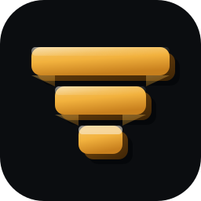
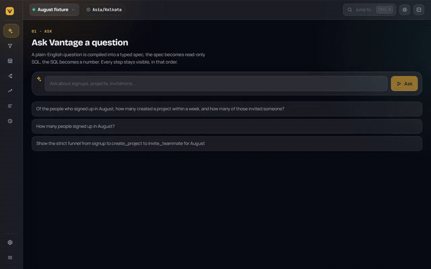
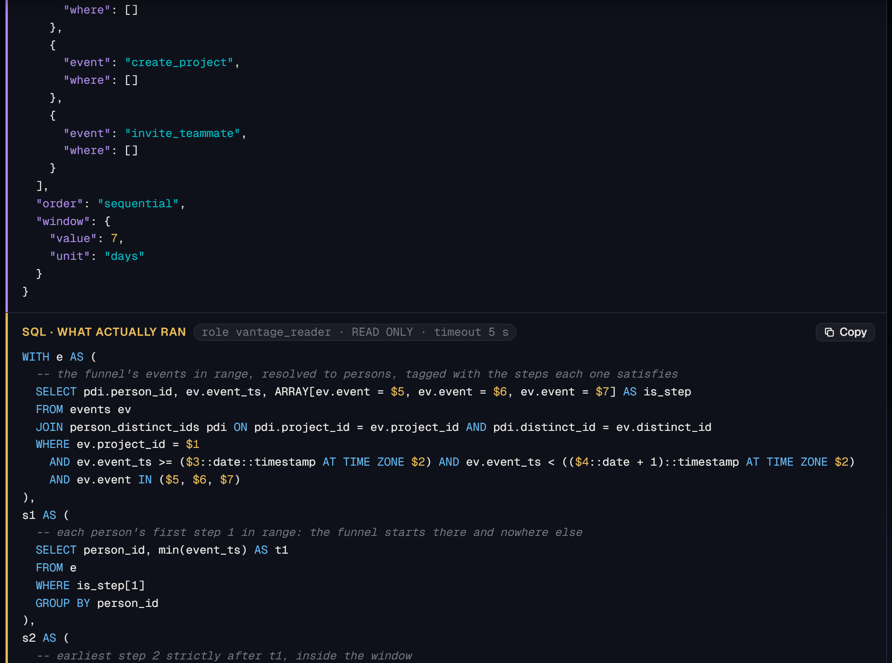
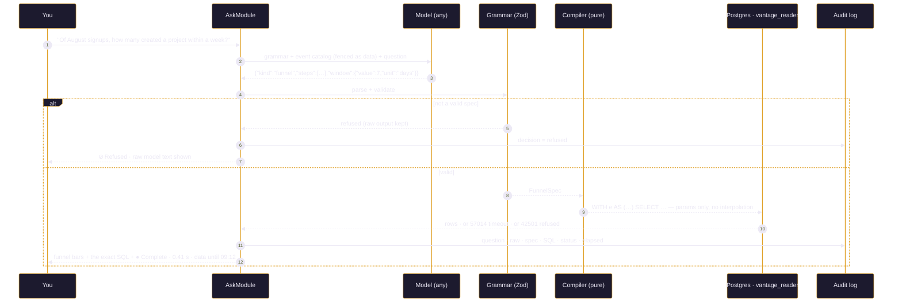
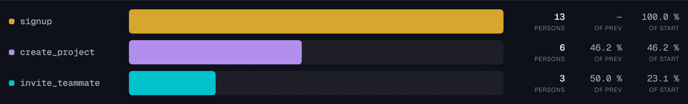
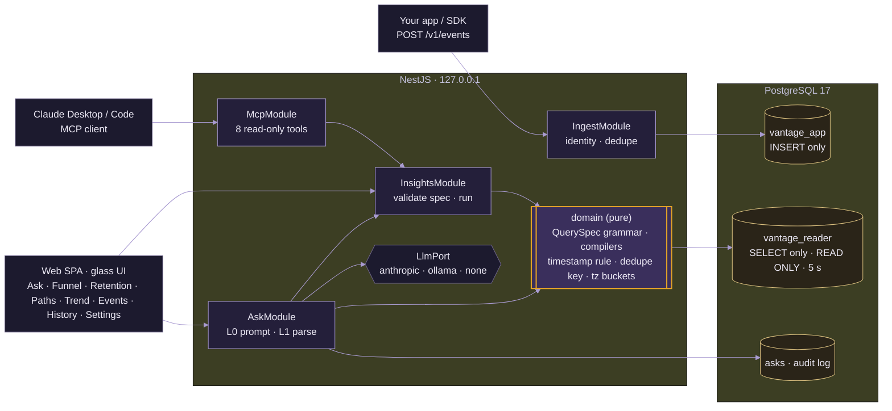

<div align="center">

<br>



# ◬ &nbsp;V A N T A G E

### **Ask in English. See the SQL. Trust the number.**

An AI-native product-analytics service — events in over HTTP, funnels and retention out as<br>
real SQL you can read — exposed as an **MCP server** so Claude can query it as a tool.

<br>

[](https://github.com/abheet19/Vantage/actions/workflows/ci.yml)
[](#-where-this-project-is)
[](#the-one-hard-idea)
[](#-quick-start)
[](LICENSE)

<br>


<br><br>

<sub>A personal project by <b><a href="https://github.com/abheet19">Abheet</a></b>, who owned A/B experimentation and product analytics at his last job and has been burned by every gotcha in here. Independent of any other project.</sub>

<br>

### ▶ &nbsp;[**Live demo → vantage-abheet.fly.dev**](https://vantage-abheet.fly.dev)

<sub><b>Try it:</b> open the app and click the example question — <i>"Of the people who signed up in August, how many created a project within a week, and how many of those invited someone?"</i> — then read the answer top to bottom: <b>spec → SQL → number</b>.</sub>

<br>

</div>

[](https://vantage-abheet.fly.dev)

<div align="center"><sub>The whole pitch in one motion, recorded against the <b><a href="https://vantage-abheet.fly.dev">live deployment</a></b>: ask the flagship question, watch it resolve <b>spec → SQL · WHAT ACTUALLY RAN → number</b> — a typed spec (violet), a <b>parameterised</b> <code>SELECT</code> that runs as <code>role vantage_reader · READ ONLY · timeout 5 s</code>, and the funnel bars it produced — then a live glance at the <b>Funnel</b> and <b>Retention</b> screens. &nbsp;▶ <b><a href="docs/media/vantage-reel.mp4">Watch the crisp 60fps MP4</a></b> &nbsp;·&nbsp; reproduce it with <code>node tools/capture-reel60.mjs</code>.</sub></div>

<br>

[](https://vantage-abheet.fly.dev)

<div align="center"><sub>The security money-shot: the model fills a typed spec (violet), the compiler turns it into a <b>parameterised</b> <code>SELECT</code> (<code>$1…$9</code>, no interpolation), and it runs as <code>role vantage_reader · READ ONLY · timeout 5 s</code>. Captured against the live deployment — reproduce it with <code>node tools/capture-hero.mjs</code>.</sub></div>

> [!NOTE]
> **Where this project is.** Design and low-level design are approved and the build is **feature-complete**
> (slices S1–S8; see [Gates](#-where-this-project-is)). Event ingestion and identity, the
> funnel/retention/trend/paths/count query engine, the structural LLM→SQL boundary, the MCP server, the
> full glass web UI, real CI, and a performance bench are all built, tested, and deployed to Fly. Everything
> below the install line runs today. No number in this README is hand-written; the only badge that asserts
> anything is the CI badge.

---

<details open>
<summary><b>Contents</b></summary>

- [The problem](#the-problem)
- [The one hard idea](#the-one-hard-idea)
- [Demo](#-demo)
- [Quick start](#-quick-start)
- [System design](#-system-design)
  - [Ask → spec → SQL → number](#ask--spec--sql--number)
  - [Three things that make it engineering](#three-things-that-make-it-engineering)
  - [Architecture](#architecture)
- [The MCP surface](#-the-mcp-surface)
- [The glass surface](#-the-glass-surface)
- [Tech stack](#-tech-stack)
- [Where this project is](#-where-this-project-is)
- [What it does not do yet](#-what-it-does-not-do-yet)
- [Design documents](#-design-documents)

</details>

---

## The problem

Product analytics tools answer questions with numbers you cannot check. Two dashboards disagree by
4 % and nobody can say why: one deduplicated retries and the other did not; one bucketed days in
UTC and the other in the product's timezone; one counted a user's *first* signup and the other any.
Now add a language model that writes the query for you, and the number is not only unverifiable
but produced by something that can be talked into anything.

## The one hard idea

**The model never writes SQL.** It fills in a small, typed **query specification** — funnel,
retention, trend, paths, count — and Vantage's own compiler turns that spec into a parameterised
`SELECT`, which runs as a database role that can *only* read, inside a read-only transaction, with
a five-second statement timeout. There is no field in the grammar that can hold SQL, no code path
from the model to the write pool, and no privilege in the database to abuse. Ask it to drop the
events table and it cannot even *say* that; if it somehow did, Postgres would refuse.

```
question ─▶ model ─▶ text ─▶ [parse as QuerySpec or REFUSE] ─▶ [compile → parameterised SELECT] ─▶ [vantage_reader · READ ONLY · 5 s] ─▶ number + the SQL
```

<div align="center"><sub>Four independent layers; remove any one and the others still hold. The full argument is in <a href="DESIGN.md"><b>DESIGN.md</b></a> (a self-contained extract of <a href="docs/01-DESIGN.md#4-the-llm-to-sql-layer-as-a-security-problem">01-DESIGN.md §4</a>) — the most interview-valuable document in this repo.</sub></div>

## ▶ Demo

The reel at the top of this page is a **real recording of the deployed app** — nothing mocked, staged,
or re-timed. It runs the showcase flow end to end:

1. **Ask** — the glass Ask screen with its example questions; the flagship one is clicked and `POST /v1/ask` fires.
2. **Spec** — the model's answer arrives as a typed **`QuerySpec`** (violet): `kind: "funnel"`, a date range, ordered steps, a 7-day conversion window.
3. **SQL · what actually ran** — the compiler's **parameterised `SELECT`** with its `role vantage_reader · READ ONLY · timeout 5 s` badge and the `$1…$9` bound parameters.
4. **The number** — the funnel bars the question produced: **signup 13 → create_project 6 → invite_teammate 3** in a 7-day window, each bar carrying its share of the previous step and of the first.
5. **A glance at the rest** — the **Funnel** builder and the **Retention** cohort heatmap, run live, so the SQL panel that powers Ask is visibly the same engine everywhere.

| Format | File | Notes |
|--------|------|-------|
| **MP4** (crisp) | [`docs/media/vantage-reel.mp4`](docs/media/vantage-reel.mp4) | H.264, 1280×800, **true 60 fps** (motion-interpolated), ~1.8 MB |
| **GIF** (inline) | [`docs/media/vantage-demo.gif`](docs/media/vantage-demo.gif) | looping, ~720 px, the embed above |

```powershell
# regenerate both from the LIVE deployment (Playwright drives it, ffmpeg encodes 60fps + gif)
node tools/capture-reel60.mjs
# or point it at a local web build:
$env:VANTAGE_URL = 'http://127.0.0.1:4200'; node tools/capture-reel60.mjs
```

<sub>ffmpeg is auto-detected (PATH → the winget install → <code>$FFMPEG</code>). The 60 fps is done with <code>ffmpeg -r 60</code> and the <code>minterpolate</code> filter; the GIF is palette-quantised for size. See <a href="docs/DEMO.md">docs/DEMO.md</a> for the 90-second live-narration script (ask → refuse a hostile question → <code>psql</code> denial → the MCP path).</sub>

## ⬇ Quick start

```powershell
git clone https://github.com/abheet19/Vantage.git; cd Vantage
npm install --legacy-peer-deps
$env:PGPASSWORD = '<your postgres superuser password>'
.\tools\db-setup.ps1      # creates the database and the three roles (owner / app / reader) idempotently
npm run check             # typecheck → lint → unit → integration (embedded Postgres 17) → coverage gates

# run the API against the hand-checked fixture, no LLM key needed:
npm run build; npm run migrate; npm run fixture:load   # prints the demo project id
$env:VANTAGE_LLM = 'none'; npm run start:api            # http://127.0.0.1:4100

# run the web UI (the glass front end) against that API:
npm run web:dev                                         # http://127.0.0.1:4200

# query it as an MCP server from Claude Desktop / Code:
npm run mcp:install -- --dry-run                        # prints the config + `claude mcp add` line
```

> [!NOTE]
> `npm run seed` loads the demo's deterministic ~200k-event synthetic product
> (`signup → create_project → invite_teammate`, realistic drop-off, decaying retention, a couple of
> anonymous→identified stitches, one device ~3 h out of clock, a few late arrivals) into a `Demo`
> project through the real ingest path. It needs the API/DB up (`npm run build; npm run migrate` first),
> prints the project id and a ready-to-paste funnel query, and is idempotent: every event carries a
> stable `insert_id`, so a second run reuses the same `Demo` project and dedupes to zero new rows. Cap
> the volume with `npm run seed -- --events 5000`. `npm run fixture:load` (above) loads the smaller
> hand-checked fixture instead.

## ⌂ System design

The whole product is one seam held open on purpose: **natural language on one side, a database on the
other, and a typed grammar wedged between them so nothing the model says can ever become SQL.** The
three pieces below — the flow, the correctness gotchas it defends against, and the module/role
topology — are the interview-relevant engineering.

### Ask → spec → SQL → number



[](https://vantage-abheet.fly.dev)

<div align="center"><sub>The number the question above resolves to — <b>signup 13 → create_project 6 → invite_teammate 3</b> in a 7-day window — every bar carrying its share of the previous step and of the first. These are the hand-checked fixture's numbers (<a href="apps/api/fixtures/august.expected.md">august.expected.md</a>: <i>"7 days: 13 → 6 → 3"</i>); the 14-day window is 13 → 8 → 4.</sub></div>

### Three things that make it engineering

| | The gotcha | What Vantage does |
|-|------------|-------------------|
| **Idempotent ingest** | A mobile client retries; the same event arrives three times | `UNIQUE (project_id, insert_id)` + `ON CONFLICT DO NOTHING`; the response says `duplicates: 2`; a derived key when the client sends none — and the design names the failure mode that leaves ([§2.4](docs/01-DESIGN.md#24-the-failure-mode-accepted-in-v1)) |
| **Funnels that stay correct and fast** | Self-joins explode on power users; a UTC `date_trunc` puts a 22:00 Mumbai signup in yesterday's cohort; a 14-day window counted from the *second* signup | Window-function CTEs over per-person streams, `AT TIME ZONE` before bucketing, first-occurrence semantics, two covering indexes tied to specific queries, and a **hand-computed fixture** whose boundary rows fail by name ([§3](docs/01-DESIGN.md#3-the-query-engine)) |
| **Honest results** | A timeout returns a 200 with half the rows; last week's cohort looks "complete" | Every result carries `status ∈ {complete, empty, timed_out, truncated, refused}`, a `data_until` watermark, and `in_progress` computed **in the SQL**; a timeout returns *nothing*, never a partial |

### Architecture



<div align="center"><sub><span style="color:#e0a128">■</span> pure domain (unit-tested with no database) &nbsp;·&nbsp; <span style="color:#a99bd1">■</span> NestJS modules &nbsp;·&nbsp; <span style="color:#d8be7e">■</span> Postgres roles. <b>InsightsModule cannot reach the model; AskModule cannot reach the write pool</b> — both enforced by a lint rule that fails the build.</sub></div>

<details>
<summary><b>Why Postgres and not DuckDB or SQLite?</b></summary>

<br>

The research pass recommended DuckDB for its analytics SQL, and it is genuinely nicer to write. But
the learning goals here are *index design and query plans* and a *read-only role*, and only
Postgres gives real roles, a database-enforced `statement_timeout`, and `EXPLAIN (ANALYZE, BUFFERS)`.
DuckDB's Node client cannot interrupt a query; SQLite has no roles and weak date maths. One free
installer is a fair price. [01-DESIGN.md §0 A1](docs/01-DESIGN.md#0-assumptions-in-place-of-clarifying-questions).

</details>

<details>
<summary><b>What can a hostile model actually cause?</b></summary>

<br>

It can misread your question and produce a *valid but wrong* query — which is why the SQL is always
shown. It can cost up to five seconds of one read-only connection. It cannot write, alter, or
create anything; cannot read a table outside the four it is granted; cannot exceed the row cap;
cannot run two statements; and cannot be manipulated by an event name into anything the grammar
cannot say. [01-DESIGN.md §4.4](docs/01-DESIGN.md#44-what-an-llm-can-and-cannot-cause-here).

</details>

<details>
<summary><b>How do you know the funnel number is right?</b></summary>

<br>

A 1,046-submission fixture across the named adversarial people with the arithmetic written out by hand in
`august.expected.md`, loaded through the *real* ingest endpoint, with deliberately adversarial rows:
a conversion at exactly the window boundary and one second past it, an intervening event that
breaks strict order, a second signup that must not restart the clock, a signup at 18:45 UTC that is
tomorrow in Kolkata, and one identity merge. A plausible wrong number fails a test that names the
person and the reason. [02-LLD.md §7.2](docs/02-LLD.md#72-sql-correctness-strategy-the-hand-computed-fixture).

</details>

## ⌬ The MCP surface

Eight read-only tools — `list_projects`, `list_events`, `describe_event`, `run_funnel`,
`run_retention`, `run_trend`, `run_paths`, `explain_query` — over stdio, every one annotated
`readOnlyHint: true, destructiveHint: false`. There is **no `run_sql` and no `ask` tool**: the MCP
client's own model does the English-to-spec step, so Vantage needs no LLM key of its own to be
fully usable from Claude Desktop or Claude Code. Every tool result carries the SQL it ran.

```powershell
# registers Vantage in Claude Desktop on Windows using an absolute node path (the bare-npx pitfall is avoided)
npm run mcp:install                  # writes claude_desktop_config.json (merges around other servers, backs up first)
npm run mcp:install -- --dry-run     # or preview it, and the `claude mcp add` one-liner, without writing
```

## ✦ The glass surface

The shipped UI is an **"observatory": opaque data surfaces, glass only on the navigation layer**, and a
**query card** that reads *question → spec → SQL → number* before the eye reaches a chart. Every number
wears its status in the same typographic voice. The redesign adds a **`Ctrl K` command palette** ("Jump
to…"), a collapsible glass rail, and Bricolage/Manrope type. Eight rail screens — **Ask, Funnel,
Retention, Paths, Trend, Events, History**, and a **Settings** shell that folds **Projects & ingest, MCP,
and Health** behind a sub-nav (each still its own deep-linkable route).

<div align="center">

**[▶ Open the interactive prototype](docs/prototype/vantage.html)** — every screen and every flow, clickable

</div>

| Ask | Refused | Retention | History |
|-----|---------|-----------|---------|
| spec (violet) → SQL (amber) → bars → `● Complete · 0.41 s` | `⊘ Refused` with the raw model output; nothing ran | cohort heatmap, hatched *in progress* cells | every ask: raw output · spec · SQL · decision · elapsed |

## ⚙ Tech stack

| Layer | Choice | Why |
|-------|--------|-----|
| API | NestJS 12 | module boundaries make the model/database seam visible; DI tokens make the two pools distinct |
| Contracts | Zod | one schema is the HTTP DTO, the MCP `inputSchema`, and the TypeScript type |
| Database | PostgreSQL 17, `pg` | roles, `statement_timeout`, covering indexes, BRIN, real plans |
| MCP | `@modelcontextprotocol/sdk`, stdio | the spec's own recommendation for local servers |
| LLM | pluggable port: Anthropic API (paid, optional) · Ollama (free, local) · `none` (canned demo specs) | $0 to run; the MCP path needs no model at all |
| Web | React 19, Vite; purpose-built SVG/HTML for funnel bars, retention grid, transitions table | the SQL panel is the product, not chart variety |
| Deploy | Docker + Caddy on **Fly.io**; release build stamps its commit at `/health.release_sha` | one container, health-gated, reproducible |
| Tests | Vitest, fast-check, supertest, a Postgres service container in CI | property tests for the compiler; a hand-computed fixture for correctness |

> [!TIP]
> **Verification snapshot (16 September 2026):** [AI handoff and durable decisions](MEMORY.md) · [implementation context](CONTEXT.md) · [executed workflows and limits](docs/VERIFICATION.md) · [sanity checklist](docs/SANITY.md) · [setup/deploy operations](docs/DEPLOY.md). The current 857-case gate covers 682 API/contracts/integration cases, 160 web cases, and 15 PostgreSQL/Chromium workflows. The public audit exercises every route, all four manual builders, safe and hostile Ask, edit/re-run, disclosures, table actions, snippets, copy/refresh, MCP setup, health and 320 px semantics. Anonymous create and rotate probes must return 401. The prior 320 px Settings/Health clipping defect has a regression test. The public deterministic adapter still uses an explicit question allowlist; unknown and injection-suffixed text is refused rather than guessed. A bounded prior mobile Lighthouse run measured 99 performance, 100 accessibility, 100 SEO, and zero CLS; the production dependency audit reports zero vulnerabilities. Confirm the exact deployed revision from `/health.release_sha` before attributing these results to a live release.

## ◬ Where this project is

| Gate | Document | Status |
|------|----------|--------|
| 1 · Design | [docs/01-DESIGN.md](docs/01-DESIGN.md) · [docs/03-UI.md](docs/03-UI.md) · [prototype](docs/prototype/vantage.html) | **approved 2026-09-05** |
| 2 · LLD | [docs/02-LLD.md](docs/02-LLD.md) | **approved 2026-09-05** |
| 3 · Build | eight slices; the boundary and funnel correctness proven first ([LLD §8](docs/02-LLD.md#8-slices)) | **feature-complete — S1–S8 built and tested (S1–S4 also hardened after hostile review)** |

The full approval and per-slice record — what each slice built, what every hostile review found, and
how each fix was tested — is in [docs/00-GATES.md](docs/00-GATES.md). CI runs the six-gate suite
(`npm run check`) against a real PostgreSQL 17 on Ubuntu plus the unit half on Windows, and a separate
[bench job](.github/workflows/ci.yml) guards funnel/retention/paths performance; the badge at the top
reflects those runs.

## ∅ What it does not do yet

The deliberate limits are listed in [01-DESIGN.md §7](docs/01-DESIGN.md#7-what-i-am-not-building). The public deployment can require shared read/admin bearer tokens, but it does not implement per-user authentication, authorization, or operator isolation:
multi-tenancy between operators · a chart library or saved
dashboards · real-time streaming · alerting, anomaly detection, A/B analysis · free-text SQL from
the model or from MCP clients · session replay or autocapture · partitioning and pre-aggregation
(the named path once `EXPLAIN` says so) · anything that belongs to another project.

## ▤ Design documents

| Doc | What it holds |
|-----|---------------|
| [DESIGN.md](DESIGN.md) | the LLM-to-SQL boundary as a security problem — the four layers, the "drop the events table" trace, what a hostile model can and cannot cause (the interview centrepiece) |
| [docs/DEMO.md](docs/DEMO.md) | the 90-second demo script with the exact commands: ask → see the SQL → hostile question refused → `psql` denial → the MCP path |
| [00-GATES.md](docs/00-GATES.md) | the gate process, approval record, and the verbatim build prompt for Gate 3 |
| [01-DESIGN.md](docs/01-DESIGN.md) | event model, idempotent ingestion argued, the real funnel and retention SQL, the LLM boundary as a security problem, MCP surface, architecture, scope, demo, risks |
| [02-LLD.md](docs/02-LLD.md) | NestJS module map, full schema with the reason for every index, Zod contracts, 14 invariants, the query grammar as a type, MCP tool contract, the hand-computed fixture strategy, slices, adversarial plan |
| [03-UI.md](docs/03-UI.md) | the "Observatory glass" design language, status vocabulary with exact copy, every screen and flow |
| [prototype/vantage.html](docs/prototype/vantage.html) | the clickable high-fidelity prototype the build ported |
| [research/](docs/research/) | dated research brief (analytics UIs, local databases, MCP 2026-07-28, NestJS 12, correctness gotchas, LLM-to-SQL prior art) |
| [tools/capture-reel60.mjs](tools/capture-reel60.mjs) | records the **60fps demo reel** at the top of this file. `node tools/capture-reel60.mjs` drives the live deployment with Playwright, records the showcase flow as `.webm`, and ffmpeg encodes a motion-interpolated 60fps `docs/media/vantage-reel.mp4` plus a looping `docs/media/vantage-demo.gif`. Point it at a local build with `VANTAGE_URL=http://127.0.0.1:4200`; ffmpeg is auto-detected (PATH → winget → `$FFMPEG`) |
| [tools/capture-hero.mjs](tools/capture-hero.mjs) | recaptures the two PNG stills (`vantage-ask.png`, `vantage-funnel.png`) from the live deployment |

---

<div align="center">
<sub>MIT · Sources in <a href="docs/01-DESIGN.md#10-sources-i-will-cite-in-an-interview">01-DESIGN.md §10</a>: OWASP LLM Top 10, MCP specification 2026-07-28, Amplitude / Mixpanel / Segment dedupe docs, PostHog funnel and retention semantics, PostgreSQL roles and covering indexes.</sub>
</div>
